## Práctica 6: CI/CD con GitHub Actions

En esta práctica vamos a configurar un pipeline con GitHub Actions que tendrá los siguientes pasos:

1. Compilar el proyecto.
2. Lanzar los tests.
3. Crear el árbol de dependencias.
4. Calcular la cobertura del código.


📌 Para la realización de esta práctica, utiliza ramas en este repositorio. Puedes usar tantas ramas como creas conveniente. Realiza tantos commits como veas necesario. También puedes utilizar PR o cualquier elemento de Git/GitHub. Además, partiremos del código que hicimos en la **práctica 5**.

### Introducción

**GitHub Actions** es una plataforma de automatización integrada dentro de GitHub que permite automatizar, personalizar y ejecutar flujos de trabajo directamente desde un repositorio. 
Con GitHub Actions se pueden configurar acciones para responder a eventos específicos en el repositorio, como commits, pull requests, etc. 

Estas acciones se ejecutan en contenedores virtuales, lo que permite realizar una amplia gama de tareas, desde pruebas automatizadas y construcción de software hasta despliegue en la nube y notificaciones personalizadas. Con una sintaxis simple basada en YAML y una integración completa con GitHub, GitHub Actions simplifica la automatización del flujo de trabajo de desarrollo.

Para proyectos en Java, se configura el pipeline mediante el archivo `maven.yml`, dentro de la carpeta `.github/workflows`. Este archivo se utiliza para definir los pasos que GitHub Actions debe seguir para compilar, probar y, opcionalmente, desplegar la aplicación. Este fichero se estructura en `jobs` que a la vez están compuestos de `steps`.

### Configuración básica del pipeline

En primer lugar, crearemos el archivo `maven.yml` directamente desde el repositorio. Para ello, iremos a la parte de **Actions** y en la opción de **Java with Maven** seleccionaremos **Configure**.


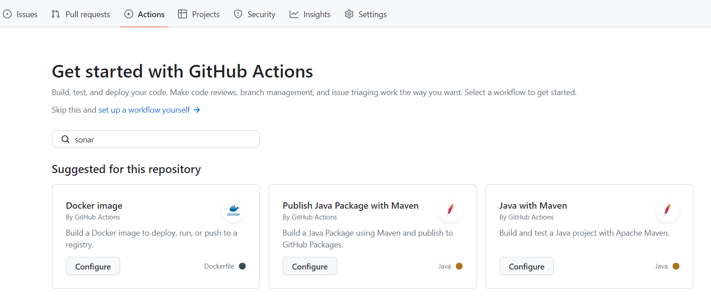

Se abrirá el editor del archivo, donde pondremos la siguiente configuración para indicar que compile el proyecto y lance los tests:

```
name: Java CI with Maven

on:
  push:
    branches: [ "main" ] # indicamos que se lanzará el pipeline cuando se haga push en la rama main
  pull_request:
    branches: [ "main" ] # indicamos que se lanzará el pipeline cuando se haga una PR en la rama main

jobs:
  build:
    runs-on: ubuntu-latest # indicamos que la ejecución se realizará en la última versión disponible del SO ubuntu
    steps: # secuencia de pasos a seguir
    - uses: actions/checkout@v3 # clona el repositorio
    - name: Set up JDK 21 # nombre del paso (opcional)
      uses: actions/setup-java@v3 # configura el entorno con Java 21
      with:
        java-version: '21'
        distribution: 'temurin'
        cache: maven
    - name: Build discovery-service
      run: mvn -B package --file discovery-service/pom.xml # lanzamos el comando especificado

    - name: Build students-service
      run: mvn -B package --file students-service/pom.xml

    - name: Build subjects-service
      run: mvn -B package --file subjects-service/pom.xml
```

Tras ello, pulsaremos `Commit changes`:

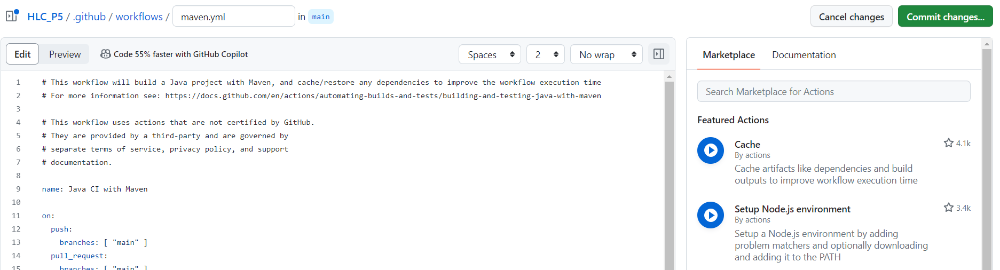


Al hacer el commit, se dispara el flujo y podemos ver el progreso de nuevo en la parte de **Actions**. Si entramos en él, veremos que se ha compilado el proyecto y se han lanzado los tests. Si hay algún error se marcará la build como errónea, pero si va bien mostrará lo siguiente:

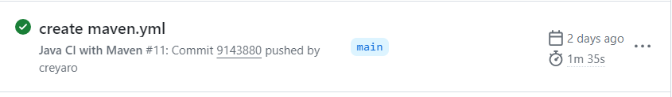

💡 Tras configurar el pipeline y hacer el commits, ¿se lanza la ejecución? En caso negativo, **analiza el contenido del fichero** `maven.yml` y realiza el cambio necesario para que se ejecute.

### Creación del árbol de dependencias

GitHub Actions tiene una funcionalidad que permite mostrar todo el árbol de dependencias de un proyecto. Conocer este árbol permite tener una visión general de cómo se estructura el proyecto, optimizarlo más fácilmente o encontrar vulnerabilidades.

1. Como paso previo tendremos que dar a Github Actions permisos para leer y escribir en el repositorio. Vamos a **Settings** y bajo la parte de **Actions > General** seleccionamos **Read and write permissions**.

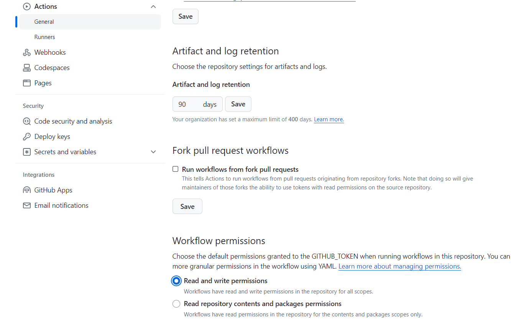

2. Después será necesario activar el grafo de dependencias. Lo haremos desde **Settings > Security > Code security and analysis**.

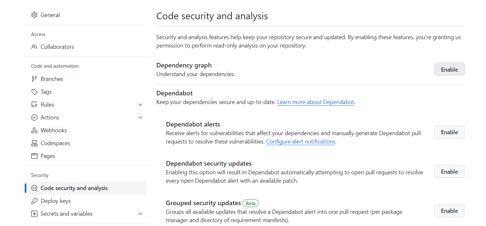

3. Añadimos a nuestro fichero `maven.yml` el siguiente job:

```
analyze:
    runs-on: ubuntu-latest
    strategy:
      matrix:
        language: [ 'java' ]

    steps:
      - name: Checkout code
        uses: actions/checkout@v3

      - name: Initialize CodeQL
        uses: github/codeql-action/init@v2
        with:
          languages: ${{ matrix.language }}
          no-autobuild: false

      - name: Analyze with CodeQL
        uses: github/codeql-action/analyze@v2
        with:
          directory: students-service
```

4. Tras subir los cambios, si vamos nuevamente a la parte de Actions veremos que se está ejecutando el pipeline:


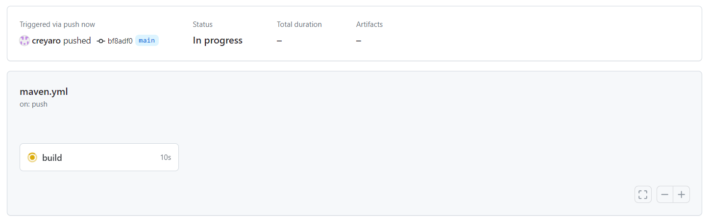

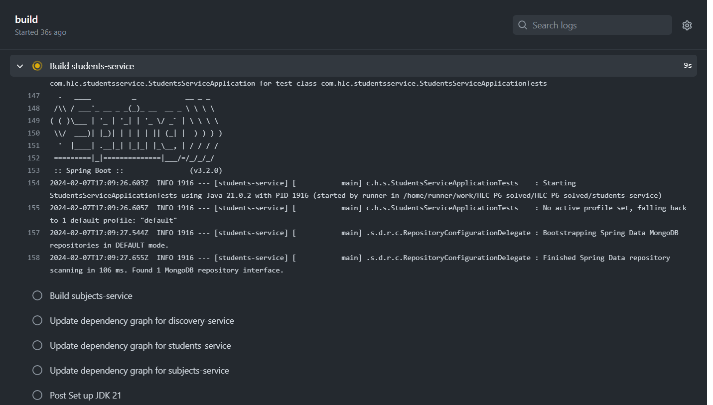

5. Cuando termina el pipeline, si no ha ocurrido ningún problema podremos ver las dependencias en la parte de **Insights > Dependency graph**.


### Cobertura de código

La cobertura de código es la medida que nos indican el porcentaje de código que cubren nuestros tests. Para nuestro proyecto usaremos **JaCoCo** (Java Code Coverage), una herramienta de código abierto utilizada para medir la cobertura de código en aplicaciones Java. 
JaCoCo dispone de una acción predefinida en GitHub actions: https://github.com/marketplace/actions/jacoco-reporter

Para configurar JaCoCo tendremos que seguir los siguientes pasos:

1. Añadir el plugin de Java a nuestro proyecto, por ejemplo, students-service. Para ello añadimos las siguientes líneas al archivo `pom.xml`:

```
<plugin>
    <groupId>org.jacoco</groupId>
    <artifactId>jacoco-maven-plugin</artifactId>
    <version>0.8.11</version>
    <executions>
        <execution>
            <goals>
                <goal>prepare-agent</goal>
            </goals>
        </execution>
        <execution>
            <id>report</id>
            <phase>prepare-package</phase>
            <goals>
                <goal>report</goal>
            </goals>
        </execution>
    </executions>
</plugin>
```

2. Si lanzamos el comando `./mvnw install` se compilará el proyecto, se lanzarán los tests y se comprobará la cobertura. Los resultados se generan en varios formatos, como XML y HTML en la carpeta `target/site/jacoco`. Si abrimos el archivo `students-service/target/site/jacoco/index.html`, podremos visualizar los resultados en el navegador:

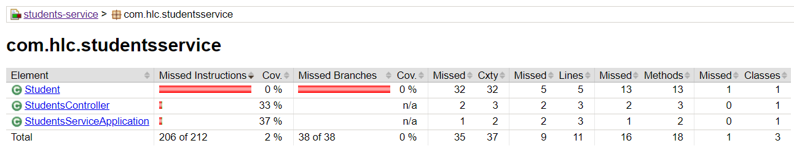

3. Para tener estos resultados como parte de nuestro pipeline de GitHub Actions, modificaremos el archivo `maven.yml` y añadimos las siguientes líneas (para más detalles sobre la configuración de esta acción, revisa su documentación):

```
- name: JaCoCo code coverage report for students-service
  id: jacoco_reporter
  uses: PavanMudigonda/jacoco-reporter@v4.9 # añadimos el visualizador de los resultados
  with:
    coverage_results_path: students-service/target/site/jacoco/jacoco.xml
    coverage_report_name: Coverage for students-service
    coverage_report_title: Coverage for students-service
    skip_check_run: false
    minimum_coverage: 80
    fail_below_threshold: false
    publish_only_summary: false

- name: Upload JaCoCo coverage report 
  uses: actions/upload-artifact@v2 # subimos el report resultante a GitHub
  with:
    name: jacoco-report
    path: students-service/target/site/jacoco/
```

4. Subimos los cambios y observamos que se muestra una sección **Coverage for students-service** donde podemos visualizar el resultado:

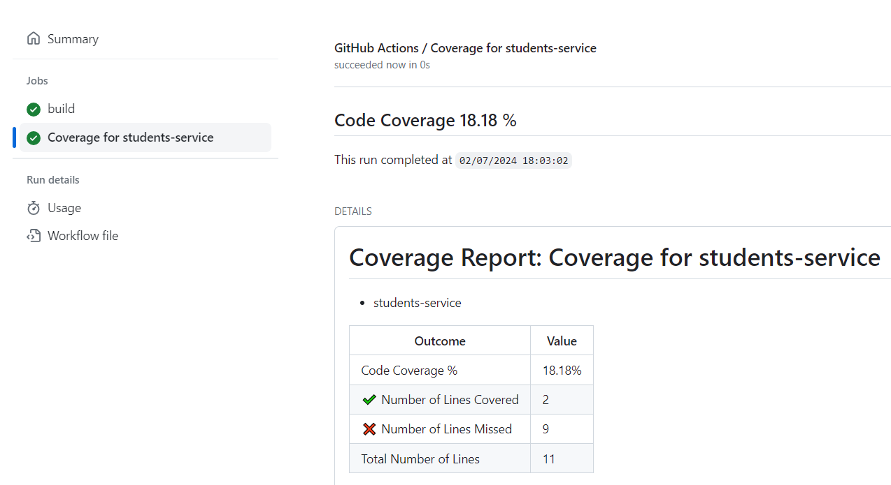

5. Si vamos a la parte de artifacts, veremos que el report está subido y permite que sea descargado:

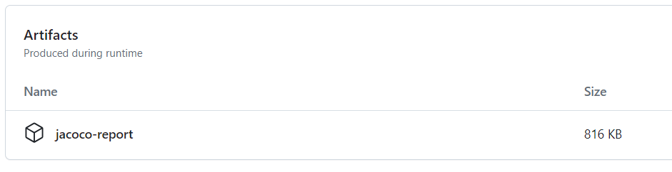

### Swagger

Swagger es una herramienta de código abierto que permite describir, documentar y probar APIs de manera eficiente. Swagger genera automáticamente una interfaz de usuario interactiva (Swagger UI) a partir de la descripción de la API que permite probar los endpoints.

Para añadir Swagger a nuestro proyecto basta con añadir la siguiente dependencia al archivo `pom.xml`:

```
<dependency>
  <groupId>org.springdoc</groupId>
  <artifactId>springdoc-openapi-starter-webmvc-ui</artifactId>
  <version>2.0.3</version>
</dependency>
```

Tras ello, iniciamos el proyecto y accedemos a `/swagger-ui.html`. Se mostrará la interfaz de Swagger donde se listan los endpoints y podemos interactuar con ellos:

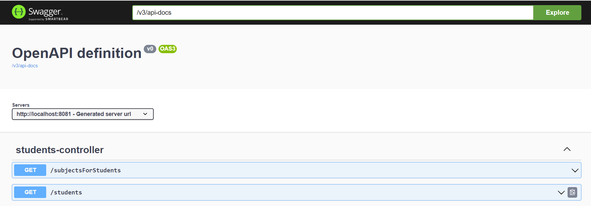